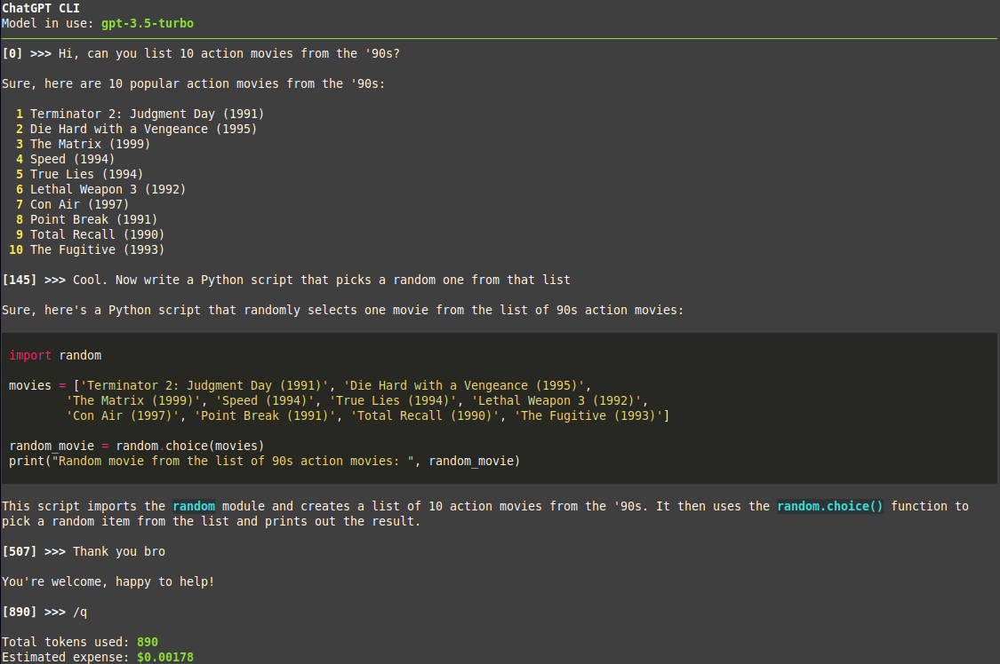

# ChatGPT CLI

## Overview

Simple script for chatting with ChatGPT from the command line, using the official API ([Released March 1st, 2023](https://openai.com/blog/introducing-chatgpt-and-whisper-apis)). It allows, after providing a valid API Key, to use ChatGPT at the maximum speed, at a fraction of the cost of a full ChatGPT Plus subscription (at least for the average user).

## How to get an API Key

Go to [platform.openai.com](https://platform.openai.com) and log-in with your OpenAI account (register if you don't have one). Click on your name initial in the top-right corner, then select *"View API keys"*. Finally click on *"Create new secret key"*. That's it.

You may also need to add a payment method, clicking on *Billing --> Payment methods*. New accounts should have some free credits, but adding a payment method may still be mandatory. For pricing, check [this page](https://openai.com/pricing).

## Installation and essential configuration

You need Python installed on your system.

Clone the repository:

`git clone https://github.com/marcolardera/chatgpt-cli.git`

`cd chatgpt-cli`

Install the dependencies:

`pip install -r requirements.txt`

After that, edit the *config.yaml* file, putting your API Key as the value of the `api-key` parameter. Save the file.

As an alternative, is possible to configure the API Key using the environment variable `OAI_SECRET_KEY` (Check your operating system's documentation on how to do this).

## Models

ChatGPT CLI, by default, uses the original `gpt-3.5-turbo` model. On March 14, 2023 OpenAI released the new `gpt-4` and `gpt-4-32k` models, only available to a limited amount of users for now. In order to use them, edit the `model` parameter in the *config.yaml* file. 

Check [this page](https://platform.openai.com/docs/models) for the technical details of each model.

## Basic usage

Launch the *chatgpt.py* script (depending on your environment you may need to use the `python3` command instead of `python`):

`python chatgpt.py`

Then just chat! The number next to the prompt is the [tokens](https://platform.openai.com/tokenizer) used in the conversation at that point.

Use the `/q` command to quit and show the number of total tokens used and an estimate of the expense for that session, based on the specific model in use.

## Context

Use the `--context <FILE PATH>` command line option (or `-c` as a short version) in order to provide the model an initial context (technically a *system* message for ChatGPT). For example:

`python chatgpt.py --context notes.txt`

Both absolute and relative paths are accepted.

Typical use cases for this feature are:

- Giving the model some code and ask to explain/refactor
- Giving the model some text and ask to rephrase with a different style (more formal, more friendly, etc)
- Asking for a translation of some text
